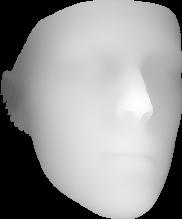

# PRNet Implementation

This is basic introduction for how to use PRNet for generating 3D vertices, depth map from 2D frames and cropping faces from pictures.

## Getting started

1. Clone the repository:

    `git clone https://github.com/YadiraF/PRNet`
  
    `cd PRNet`
    
2. Download the PRN trained model at [Pretrained Model](https://drive.google.com/file/d/1UoE-XuW1SDLUjZmJPkIZ1MLxvQFgmTFH/view?usp=sharing), and put it into Data/net-data

3. Generate 3D vertices and depth map

    `python get_depth_buffer.py`
    
4. Crop face from frames

    `python crop_face.py`
    
5. Frontalize 3D faces

    `python frontalize_face.py'
    
## Depth map demo

<figure class="third">
    
</figure>

## 3D face demo

